relion-pipeline-visualizer
==========================

Visualize RELION cryo-EM processing pipelines as structured, readable Mermaid diagrams.

This project parses RELION pipeline STAR files and converts them into
job-level directed acyclic graphs (DAGs), rendering color-coded Mermaid
flowcharts that make complex workflows easier to understand, debug, and
communicate.

The tool is intended for:
- RELION 4 and 5 users
- Cryo-EM pipeline inspection and documentation
- Academic and reproducible research workflows

**Author:** Sean Connell (sean.connell@gmail.com)
Structural Biology of Cellular Machines Laboratory, [Biobizkaia](https://www.biobizkaia.org)

This project was co-written with [Claude](https://claude.ai) (Anthropic).


Examples
--------

### Full pipeline diagram



### Focused subgraph (upstream ancestors of PostProcess/job009)



*Note: screenshots above are rendered via kroki.io from the test pipeline. The HTML output includes interactive hover tooltips with job details, commands, and model statistics — see [Viewing diagrams](#viewing-diagrams) below.*


Features
--------

- Parse RELION `default_pipeline.star` files (RELION 4 and 5)
- Derive job-to-job edges by joining through shared intermediate nodes
- Generate Mermaid `graph TD` flowcharts
- Job-type-aware color coding (Import, Extract, Refine3D, Class3D, Select, MaskCreate, PostProcess, CtfRefine, MultiBody, Subtract, JoinStar)
- Status-aware styling (Failed jobs get red borders, Running jobs get dashed orange borders)
- Full pipeline view or focused subgraph for a specific job
- Upstream (ancestors) and/or downstream (descendants) traversal
- HTML output with interactive hover tooltips showing job details
- Tooltips show last RELION command from `note.txt`
- Refine3D tooltips show pixel size, resolution, Fourier completeness, class distribution, and rotational accuracy (from `run_model.star`)
- Class3D tooltips show iteration number, pixel size, and per-class statistics from the last iteration model file
- Outputs both `.mmd` (Mermaid source) and `.html` (self-contained browser view)
- Shorthand job selection: `--job 93`, `--job job093`, or `--job Refine3D/job093/`


Installation
------------

Installation uses a Conda environment defined by environment.yml.

1. Clone the repository

```bash
git clone https://github.com/frozenfas/relion-pipeline-visualizer.git
cd relion-pipeline-visualizer
```

2. Create the Conda environment (this also installs the package)

```bash
conda env create -f environment.yml
conda activate relion-pipeline-visualizer
```

If the environment file changes, update with:

```bash
conda env update -f environment.yml --prune
```

3. Verify the installation

```bash
relion_pipeline_visualizer --help
```


Usage
-----

After activating the conda environment, the `relion_pipeline_visualizer` command is available from any directory.

### Full pipeline diagram

```bash
relion_pipeline_visualizer path/to/default_pipeline.star
```

This writes `pipeline.mmd` and `pipeline.html` to the same directory as the STAR file. Open the HTML file in a browser for an interactive diagram with hover tooltips.

### Focused subgraph for a specific job

The `--job` flag accepts shorthand notation -- you can use just the number, the job ID, or the full path:

```bash
# All equivalent:
relion_pipeline_visualizer path/to/default_pipeline.star --job 58
relion_pipeline_visualizer path/to/default_pipeline.star --job job058
relion_pipeline_visualizer path/to/default_pipeline.star --job "Refine3D/job058/"
```

Show upstream ancestors ("how did I get here?" -- default):

```bash
relion_pipeline_visualizer path/to/default_pipeline.star --job 58
```

Show downstream descendants ("what depends on this?"):

```bash
relion_pipeline_visualizer path/to/default_pipeline.star --job 53 --downstream
```

Show both directions:

```bash
relion_pipeline_visualizer path/to/default_pipeline.star --job 40 --upstream --downstream
```

### Custom output path

```bash
relion_pipeline_visualizer path/to/default_pipeline.star \
    -o /some/other/dir/my_pipeline
```

### Open in mermaid.live or kroki.io

```bash
relion_pipeline_visualizer path/to/default_pipeline.star --mermaid
relion_pipeline_visualizer path/to/default_pipeline.star --kroki
relion_pipeline_visualizer path/to/default_pipeline.star --job 93 --mermaid --kroki
```

Both flags print the URL to the terminal and open it in your browser.

### CLI options

```
positional arguments:
  star_file             Path to default_pipeline.star

options:
  --job JOB_NAME        Focus on a specific job (e.g. '58', 'job058', or 'Refine3D/job058/')
  --upstream            Include upstream ancestors (default when --job is given)
  --downstream          Include downstream descendants
  -o, --output NAME     Base name for output files (default: pipeline next to star_file)
  -f, --force           Overwrite existing output files without prompting
  --mermaid             Open the diagram in mermaid.live in your browser
  --kroki               Open the diagram as SVG via kroki.io in your browser
```

By default, the tool will refuse to overwrite existing `.mmd` or `.html` files. Use `--force` / `-f` to allow overwriting.


Viewing diagrams
----------------

### HTML output (recommended)

Open the generated `pipeline.html` in any browser. This is the only output format with **enhanced results** -- nodes are color-coded by job type, and hovering over a node shows a tooltip with:

- Job name, alias, type, and status
- Last RELION command executed (from `note.txt`)
- For Refine3D jobs: pixel size, resolution, Fourier completeness, class distribution, and rotational accuracy (from `run_model.star`)
- For Class3D jobs: iteration number, pixel size, and per-class statistics from the last iteration model file

### mermaid.live (`--mermaid`)

Opens the diagram in the [mermaid.live](https://mermaid.live) interactive editor. Useful for rearranging node layout, editing the diagram, and exporting to PNG/SVG. Does not include enhanced results (tooltips with commands and model statistics).

### kroki.io (`--kroki`)

Opens the diagram as a clean static SVG rendered by [kroki.io](https://kroki.io). Useful for sharing a direct link or embedding the diagram. Does not include enhanced results.

### Mermaid source (`.mmd`)

The raw Mermaid source file can also be pasted into https://mermaid.live or any Mermaid-compatible tool.


Roadmap
-------

Planned features and known limitations:

- [ ] Add enriched tooltips for additional job types (CtfRefine, PostProcess, MultiBody, Subtract, Extract, etc.)
- [ ] Add support for sub-tomogram averaging (STA) pipelines — currently only tested with single-particle analysis (SPA) workflows
- [ ] Add tooltip support for RELION 4 model file format differences
- [ ] Optional legend showing job type color coding


Project structure
-----------------

```
relion-pipeline-visualizer/
├── src/
│   └── relion_pipeline_visualizer/
│       ├── __init__.py
│       ├── __main__.py        # Entry point for python -m
│       ├── cli.py             # CLI argument parsing, HTML template
│       ├── parser.py          # STAR file parsing, job enrichment (note.txt, model stats)
│       ├── graph.py           # DAG operations (ancestors, descendants)
│       └── mermaid.py         # Mermaid diagram rendering
├── tests/
│   ├── test_pipeline.py       # Test suite (45 tests)
│   └── data/
│       ├── default_pipeline.star
│       ├── small_pipeline.star
│       └── small_project/     # Mock RELION project for enrichment tests
├── docs/
│   ├── pipeline_example.svg
│   └── subgraph_example.svg
├── pyproject.toml
├── environment.yml
├── README.md
└── LICENSE
```


RELION compatibility
--------------------

- Supported: RELION 4 and 5
- Tested with: single-particle analysis (SPA) pipelines
- Not yet tested: sub-tomogram averaging (STA) pipelines


Privacy and third-party services
---------------------------------

When using `--mermaid` or `--kroki`, diagram data is sent to third-party
services (mermaid.live and kroki.io respectively). The data sent includes
job names, aliases, types, and statuses from your pipeline — but not the
enriched tooltip data (commands, model statistics). If your project data is
sensitive, use only the local HTML output.

The HTML output loads the Mermaid JavaScript library from a CDN
(`cdn.jsdelivr.net`). This requires an internet connection when first
opening the file, but no project data is sent to the CDN.


License
-------

This project is licensed under the GNU General Public License v3.0 (GPL-3.0).

Copyright (C) 2025 Sean Connell (sean.connell@gmail.com)
Structural Biology of Cellular Machines Laboratory, Biobizkaia

You are free to use, modify, and redistribute this software under the terms of
the GPL-3.0. Any redistributed or modified versions must also be licensed
under GPL-3.0.

See the LICENSE file for full details.


Disclaimer
----------

This software is provided as-is, without warranty of any kind. Use at your
own risk. The tool only writes `.mmd` and `.html` output files (and will
refuse to overwrite existing files unless `--force` is used). It does not
modify your RELION project data.

This project was co-written with [Claude](https://claude.ai) (Anthropic).


Status
------

**Version 0.1.0 — Development**

This project is under active development.
APIs, command-line options, and output formats should be considered unstable
until a first tagged release.

Contributions, issues, and test STAR files are welcome.
